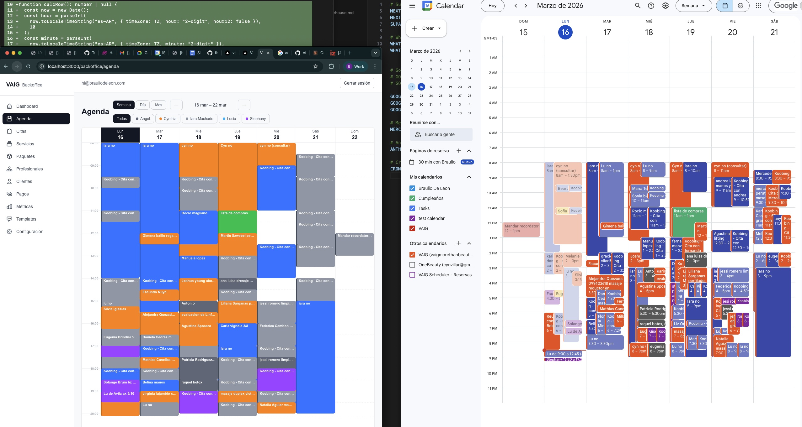
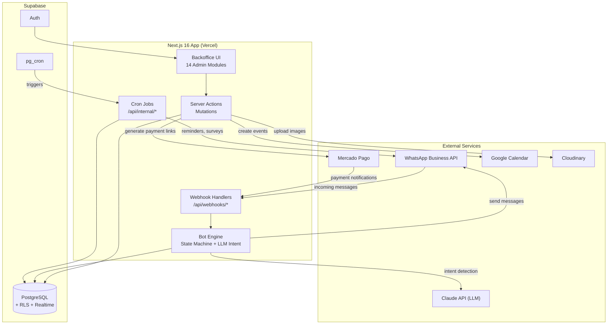
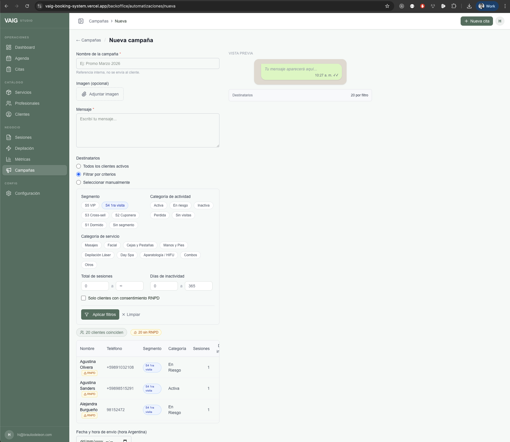
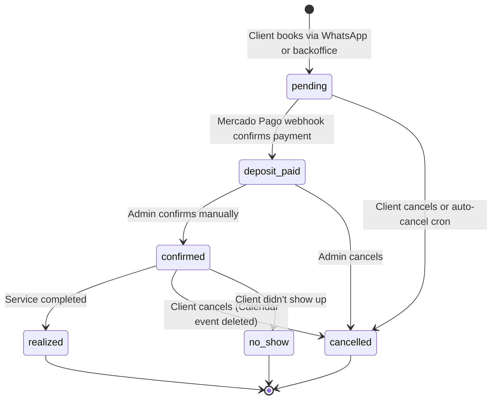

<div align="center">

# VAIG Booking System

**End-to-end booking platform for a laser hair removal & aesthetics clinic**

A production system handling 1,300+ clients and 4,700+ appointments — built with a conversational WhatsApp chatbot (powered by Claude), a full-featured admin backoffice, and automated payment & scheduling workflows.

[](https://nextjs.org/)
[](https://react.dev/)
[](https://www.typescriptlang.org/)
[](https://supabase.com/)
[](https://tailwindcss.com/)
[](https://vercel.com/)
[](LICENSE)

</div>

---

## At a Glance

| Metric | Value |
|--------|-------|
| Clients managed | 1,300+ |
| Appointments tracked | 4,700+ |
| Database migrations | 56 |
| Admin modules | 14 |
| Test suites | 8 files across 5 domains |
| Integrations | WhatsApp, Google Calendar, Mercado Pago, Claude AI, Cloudinary |

<div align="center">
  
  <br />
  <em>Backoffice agenda — multi-professional weekly calendar with color-coded services (left) synced to Google Calendar (right)</em>
</div>

---

## Architecture



---

## Key Features

### WhatsApp Chatbot

- **Conversational booking flow** — clients book appointments entirely through WhatsApp, choosing service, professional, date, and time slot via interactive menus
- **LLM-powered intent detection** — Claude Haiku classifies free-text messages with confidence scoring, routing high-confidence intents directly and falling back to menu navigation
- **Smart date parsing** — two-tier parser: regex for common patterns ("hoy", "mañana a las 5pm"), Claude Haiku fallback for complex expressions ("el próximo martes después del mediodía")
- **Campaign-aware greetings** — detects if the client received a promotional campaign in the last 48 hours and personalizes the greeting with promo context
- **State machine with 15+ states** — handles booking, rescheduling, cancellation, waitlist, pack purchase, and session history queries
- **Human handoff** — keyword detection triggers transfer to a human agent; bot pauses until released

### Admin Backoffice (14 Modules)

| Module | Description |
|--------|-------------|
| **Dashboard** | Daily stats, quick actions, greeting |
| **Agenda** | Multi-view calendar (day / 4-day / week / month) with drag support |
| **Appointments** | Tab-based weekly view, inline editing, status transitions |
| **Clients** | Search, segment filters (S1–S5), service categories, duplicate detection & merge |
| **Services** | CRUD with inline editing, category grouping |
| **Professionals** | Schedule management, availability overrides |
| **Packages** | Multi-session pack management with usage tracking |
| **Sessions** | Weekly view, inline payment editing, XLSX export |
| **Inbox** | Real-time WhatsApp conversations (Supabase Realtime), admin reply, handoff controls |
| **Campaigns** | Bulk WhatsApp messaging with 6-criteria recipient filtering, template preview |
| **Reminders** | Manual reminder page for next-day bookings |
| **Metrics** | Conversion funnel, activity charts, depilation KPIs, demand heatmap (Recharts) |
| **Payments** | Payment tracking and confirmation |
| **Settings** | System configuration, WhatsApp templates |

<div align="center">
  
  <br />
  <em>Campaign builder with segment, category, and activity filters for targeted WhatsApp outreach</em>
</div>

### Scheduling Engine

- **Pure-function availability calculator** — no side effects, fully testable with 114+ unit tests
- **Per-professional schedules** with weekly recurring hours and date-specific overrides
- **Conflict detection** against existing bookings and Google Calendar events
- **Waitlist** — clients join a waitlist for fully-booked slots; notified automatically on cancellation
- **Time-window grouping** — slots displayed as morning / afternoon / evening blocks for better UX

### Payments

- **Mercado Pago integration** — automatic checkout link generation, webhook confirmation with amount validation
- **Bank transfer support** — manual confirmation flow with admin controls
- **Deposit-based flow** — configurable deposit amounts per service

### Automations (Cron Jobs)

- 24h appointment reminders via WhatsApp
- Post-appointment satisfaction surveys
- Next-session suggestions based on treatment plans
- Auto-cancellation for unpaid bookings
- Google review request after realized sessions
- Payment reminders for pending deposits

### Data Import Pipeline

- **Google Calendar** — parse event summaries, match services via Levenshtein similarity, create bookings
- **Koobing** — import from legacy booking system (4,000+ historical appointments)
- **Google Sheets** — sync session history from spreadsheets (ExcelJS)
- **Client deduplication** — Levenshtein-based duplicate detection with optimized first-name blocking (O(n) exact + blocked fuzzy vs naive O(n²))

---

## Tech Stack

| Layer | Technology | Purpose |
|-------|-----------|---------|
| Framework | Next.js 16 (App Router) | SSR, Server Actions, API routes |
| UI | React 19 + Tailwind CSS 4 + shadcn/ui | Component library with Sage Green design system |
| Database | Supabase (PostgreSQL) | Auth, RLS, Realtime subscriptions, pg_cron |
| Chatbot | WhatsApp Business API (Meta Cloud) | Conversational interface |
| AI | Claude API (Anthropic SDK) | Intent detection, date parsing, smart replies |
| Calendar | Google Calendar API (Service Account) | Bidirectional event sync |
| Payments | Mercado Pago (Checkout Pro) | Payment links, webhook confirmation |
| Charts | Recharts | Metrics dashboards |
| Spreadsheets | ExcelJS | Session export (XLSX) |
| Images | Cloudinary | Campaign image uploads |
| Icons | Lucide React | Consistent iconography |
| Notifications | Sonner | Toast notifications |
| Deploy | Vercel | Hosting, serverless functions |

---

## Project Structure

```
src/
├── actions/              # Server Actions (booking, client, service mutations)
├── app/
│   ├── api/
│   │   ├── internal/     # Cron job endpoints (reminders, surveys, auto-cancel)
│   │   ├── sesiones/     # Session export (XLSX download)
│   │   └── webhooks/     # WhatsApp & Mercado Pago webhook handlers
│   ├── backoffice/       # 14 admin modules (auth-protected)
│   └── login/            # Authentication page
├── components/
│   ├── backoffice/       # Domain-specific components (calendar, inbox, forms)
│   └── ui/               # shadcn/ui primitives (Button, Dialog, Table, etc.)
└── lib/
    ├── bot/              # Chatbot engine (state machine, intent, date parser)
    ├── campaigns/        # Bulk WhatsApp message processor
    ├── constants/        # Segment definitions, service categories
    ├── gcal/             # Google Calendar client & import engine
    ├── koobing/          # Koobing legacy system import
    ├── payments/         # Mercado Pago client
    ├── scheduler/        # Availability calculator (pure functions)
    ├── supabase/         # Supabase clients (server, admin, middleware)
    └── whatsapp/         # WhatsApp Business API client (logged send wrappers)

supabase/
└── migrations/           # 56 SQL migrations (enums → views → RLS policies)

scripts/                  # Import & migration CLI tools
```

---

<details>
<summary><strong>Booking State Machine</strong></summary>



**Business rules:**
- Google Calendar event created only on transition to `confirmed`
- `deposit_paid → confirmed` is always a manual admin action
- Mercado Pago webhook validates amount matches `deposit_amount`
- `sessions_used` in packages increments on `realized`, not `confirmed`
- WhatsApp webhook responds `200` immediately, processes asynchronously

</details>

<details>
<summary><strong>Client Segmentation (S1–S5)</strong></summary>

Clients are automatically segmented via a SQL view (`clientes_metricas`) using a priority-based CASE expression:

| Segment | Criteria | Intent |
|---------|----------|--------|
| S5 | 11+ total sessions AND 30+ days since last visit | High-value clients who may need reactivation |
| S4 | Exactly 1 session AND 30–90 days inactive | New clients at risk of churn |
| S3 | Single service type (depilation) AND active/at-risk category | Cross-sell opportunity |
| S2 | Has 5+ sessions in legacy coupon history (`sesion_n >= 5`) | Advanced coupon users |
| S1 | 60–120 days inactive | General reactivation candidates |

Segments are evaluated in S5→S1 order (first match wins). Clients matching none remain unsegmented.

Segmentation drives campaign targeting, analytics dashboards, and client list filters.

</details>

<details>
<summary><strong>Bot Conversation Flow</strong></summary>

```
Idle → Intent Detection (LLM)
  ├─ High confidence → Direct routing
  └─ Low confidence → Menu display

Menu states:
  ├─ book → select service → select professional → select date/time → confirm → payment
  ├─ cancel → show bookings → select → confirm cancellation
  ├─ pack → select pack service → select pack → payment
  └─ mis turnos → show booking history

Special triggers (any state):
  ├─ "mis turnos" / "historial" → booking history
  ├─ handoff keywords → transfer to human agent
  └─ "0" / back → return to previous state
```

The bot uses a **campaign-aware** greeting: if the client received a WhatsApp campaign in the last 48 hours, the bot personalizes the welcome message with the promotion context.

</details>

<details>
<summary><strong>Database Schema Overview</strong></summary>

**56 migrations** covering:

- **Core tables**: `clients`, `services`, `professionals`, `bookings`, `client_packages`
- **Bot tables**: `conversation_sessions`, `messages` (with WhatsApp message tracking)
- **Campaign tables**: `campaigns`, `campaign_recipients`
- **Support tables**: `waitlist`, `schedule_overrides`, `system_config`, `sesiones_historicas`
- **Views**: `clientes_metricas` (complex CTE with segmentation), `inbox_conversations` (joins for inbox UI)
- **Enums**: `booking_status`, `payment_method`, `client_source`
- **RLS**: Row-level security enabled on all tables
- **Indexes**: Optimized for common query patterns (phone lookup, date ranges, status filters)

</details>

---

Sistema de reservas end-to-end para **VAIG — Depilación Láser & Estética**. Combina un chatbot conversacional de WhatsApp (con LLM), un motor de scheduling, un backoffice web para el equipo, y automatizaciones post-atención.

### Prerequisites

- Node.js 22+
- Supabase project with PostgreSQL
- WhatsApp Business API (Meta Cloud API)
- Google Cloud Service Account with Calendar API enabled
- Mercado Pago account (optional — for payment integration)
- Anthropic API key (for chatbot AI features)

### Installation

```bash
git clone https://github.com/bradelev/vaig-booking-system.git
cd vaig-booking-system

npm install

cp .env.example .env.local
# Fill in your credentials (see .env.example for all variables)

npx supabase db push

npm run dev
```

### Environment Variables

See [`.env.example`](.env.example) for the full list. Key groups:

| Group | Variables |
|-------|----------|
| Supabase | `NEXT_PUBLIC_SUPABASE_URL`, `NEXT_PUBLIC_SUPABASE_ANON_KEY`, `SUPABASE_SERVICE_ROLE_KEY` |
| WhatsApp | `WHATSAPP_ACCESS_TOKEN`, `WHATSAPP_PHONE_NUMBER_ID`, `WHATSAPP_APP_SECRET` |
| Google Calendar | `GOOGLE_SERVICE_ACCOUNT_EMAIL`, `GOOGLE_SERVICE_ACCOUNT_PRIVATE_KEY`, `GOOGLE_CALENDAR_ID` |
| Mercado Pago | `MERCADOPAGO_ACCESS_TOKEN`, `MERCADOPAGO_WEBHOOK_SECRET` |
| Claude AI | `ANTHROPIC_API_KEY` |
| Cloudinary | `CLOUDINARY_CLOUD_NAME`, `CLOUDINARY_API_KEY`, `CLOUDINARY_API_SECRET` |
| App | `NEXT_PUBLIC_APP_URL`, `CRON_SECRET` |

---

## Testing

```bash
npm run test      # Run all test suites
npm run lint      # ESLint
npx tsc --noEmit  # Type checking
```

Test coverage spans 5 domains:

| Domain | What's tested |
|--------|---------------|
| Scheduler | Slot availability, time formatting, schedule overrides |
| Bot | Engine routing, state transitions, helper functions |
| Webhooks | WhatsApp signature verification, payload parsing |
| Payments | Mercado Pago webhook processing |
| Actions | Booking CRUD operations |

---

## Deployment

The app is designed for **Vercel** (Hobby tier compatible). Background jobs run via **Supabase pg_cron**, which calls `/api/internal/*` endpoints protected by `CRON_SECRET`.

```bash
npm run build     # Production build
npm run start     # Production server
```

---

## License

[MIT](LICENSE) &copy; 2026 Braulio De Leon
